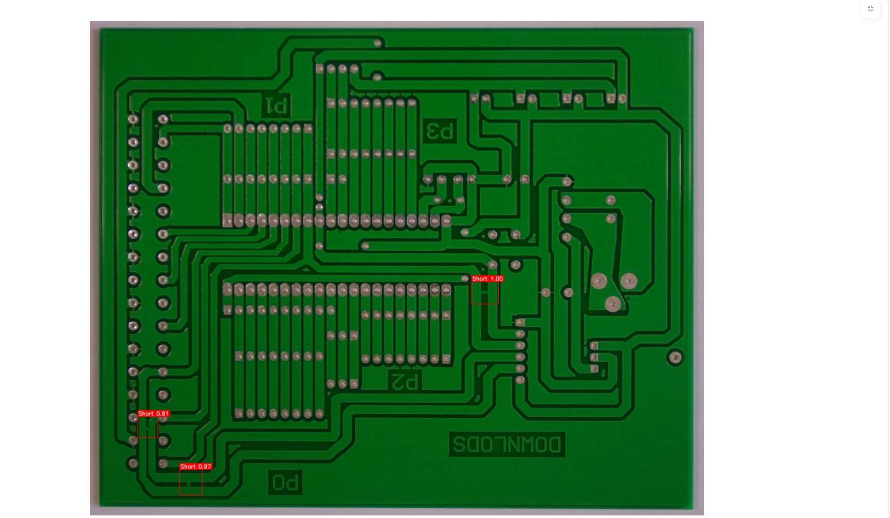
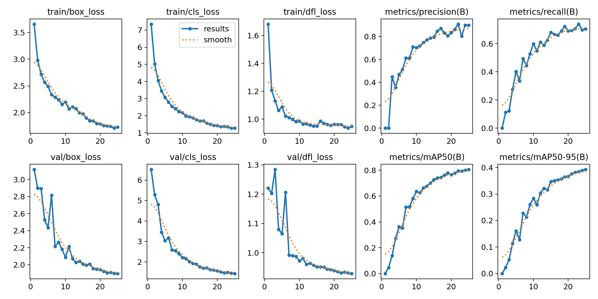
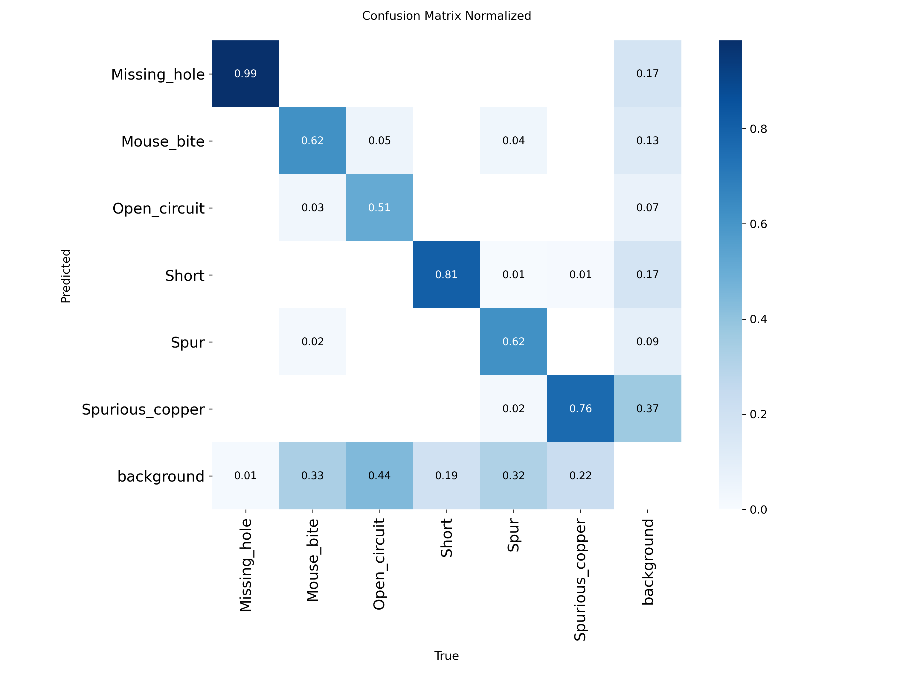
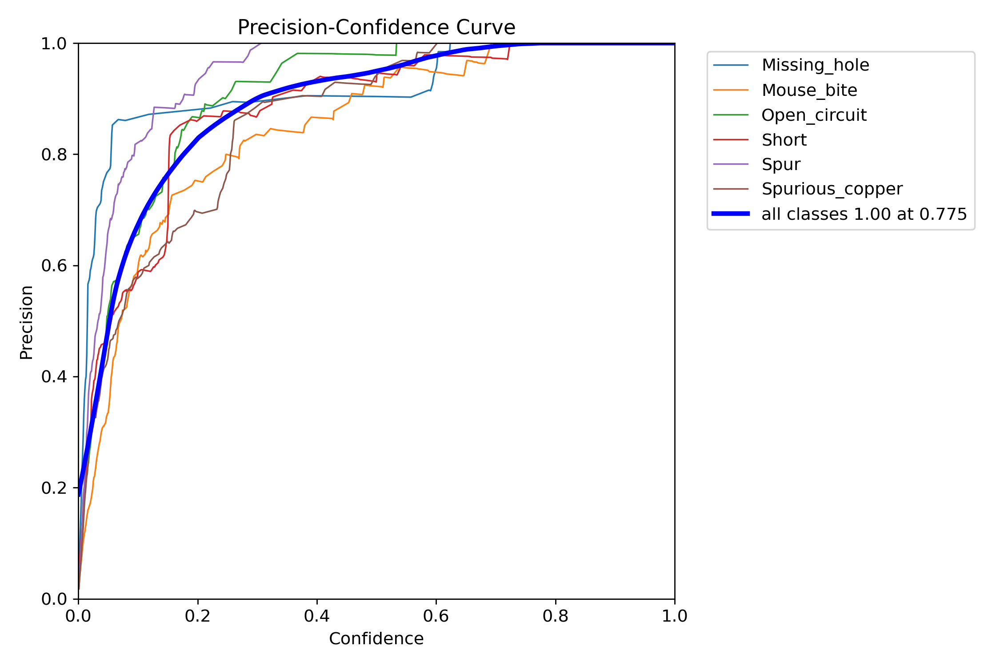
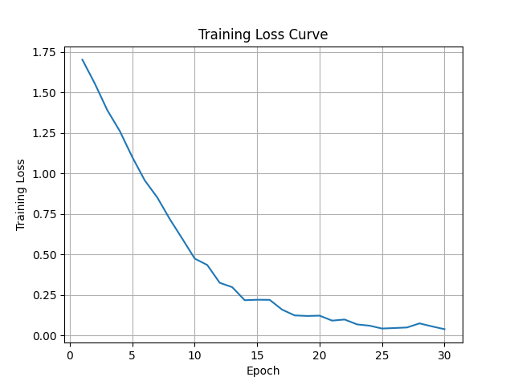
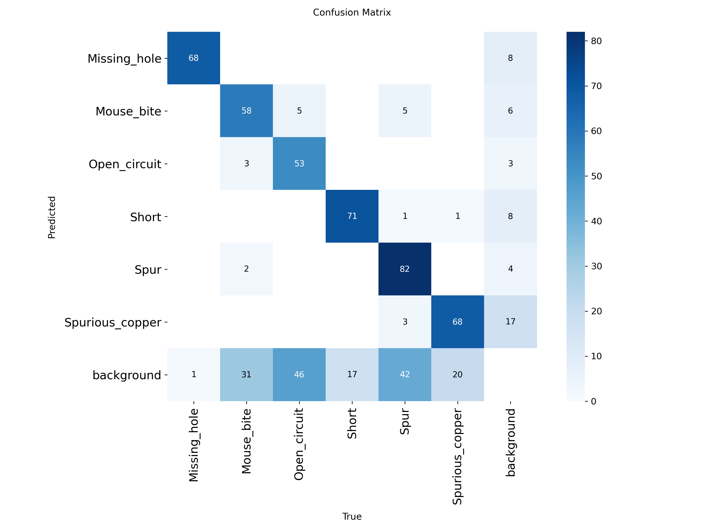

# PCB-Defect-Detection-System-Portfolio
## Project Overview

This project presents a modular deep learning pipeline for automated defect detection and classification in Printed Circuit Boards (PCBs).

The system integrates classical image preprocessing techniques with advanced deep learning models to achieve robust and accurate inspection. A YOLO-based object detection model is used to localize defect regions, while an EfficientNet-based classifier performs fine-grained defect classification.

The architecture follows a structured and scalable design under the `src/` directory, ensuring modularity, maintainability, and ease of future enhancements.


## Project Architecture
```
src/
│
├── module1_preprocessing/
│ ├── Template subtraction
│ ├── Morphological processing
│ └── Difference mask generation
│
├── module2_roi/
│ ├── ROI extraction
│ └── XML utilities
│
├── module3_training/
│ ├── Dataset preparation
│ ├── Model definition
│ └── Evaluation
│
├── module4_inference/
│ └── Defect prediction pipeline
│
├── module5_web_ui/
│ └── Streamlit interface
│
└── module6_yolo/
  └── YOLO-based detection model
```

## Modules Description

### Module 1 – Image Preprocessing
- Template alignment
- Image subtraction
- Thresholding
- Morphological cleaning
- Difference mask generation

### Module 2 – ROI Extraction
- Extraction of Regions of Interest
- XML annotation handling
- Bounding box processing

### Module 3 – Model Training
- Dataset preparation
- Training pipeline
- Evaluation metrics

### Module 4 – Inference
- Loading trained model
- Running predictions on test images

### Module 5 – Web Interface
- Streamlit-based UI for easy interaction
- Upload image and visualize predictions

### Module 6 – YOLO Model
- Deep learning-based defect detection
- Real-time bounding box predictions

## Technologies Used

- Python 3.x
- OpenCV
- NumPy
- PyTorch
- YOLO
- Streamlit
- XML processing utilities

## Model Details

This project uses a hybrid approach combining classical preprocessing, object detection, and deep learning-based classification.

### 1️⃣ YOLO Model

The YOLO (You Only Look Once) model is used for real-time PCB defect detection.

**Purpose:**
- Detect defect regions in PCB images
- Generate bounding boxes around defective areas
- Provide defect localization

**Why YOLO?**
- Fast inference speed
- Suitable for real-time inspection systems
- High detection accuracy

  **Input:**
- PCB image

**Output:**
- Bounding box coordinates
- Confidence score
- Defect class label

### 2️⃣ EfficientNet Model 

EfficientNet is used for fine-grained defect classification after ROI extraction.

**Purpose:**
- Classify cropped defect regions into specific defect categories
- Improve classification accuracy

**Why EfficientNet?**
- State-of-the-art image classification architecture
- Compound scaling (depth, width, resolution)
- High accuracy with fewer parameters
- Efficient memory usage

**Approach Used:**
- Transfer learning from pretrained weights
- Fine-tuning on PCB defect dataset
- Fully connected classification head for defect classes

**Input:**
- PCB Template image

**Output:**
- Predicted defect category
- Class probability scores


## Sample Outputs

### 🔹 1. YOLO Detection Output

.jpg)
.png)

The model detects defective regions and generates bounding boxes with confidence scores.


### 🔹 2. EfficientNet Classification Output


.png)

EfficientNet detects defective regions and generates bounding boxes with confidence scores classifies the defect region into specific defect categories.


### 🔹 3. Web Interface (Streamlit)

.png)

The web interface allows users to upload PCB images and visualize detection results interactively.


## Performance Metrics

The models were evaluated on the PCB defect dataset using standard object detection and classification metrics.

### YOLO Detection Metrics
- mAP (Mean Average Precision): 0.87
- Precision: 0.91
- Recall: 0.89

### EfficientNet Classification Metrics
- Accuracy: 92%
- Precision: 90%
- Recall: 88%


## Training & Evaluation Results

### YOLO Detection Model Performance

#### Training Curves


#### Confusion Matrix


#### Precision Confidence Curve



### EfficientNet Classification Performance

#### Training Accuracy & Loss


#### Confusion Matrix



The evaluation metrics indicate that the hybrid YOLO + EfficientNet pipeline performs reliably for automated PCB defect detection and classification tasks.

The model achieves strong detection accuracy while maintaining computational efficiency suitable for industrial deployment.


